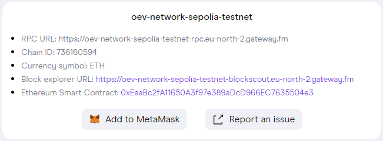
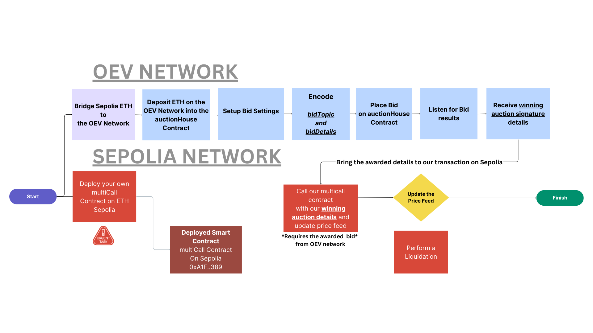

# OEV SEARCHER BOT

This repo takes you though setting up and executing a price feed searcher bot on the OEV Network allowing you to update a price feed on the ETH Sepolia test network. 

You will need ETH on both ETH Sepolia and the OEV Network for full functionality.

Only a small amount of ETH is needed for bids and transactions costs on the OEV Network. 

You can bridge from ETH Sepolia to the [OEV Network here](https://oev-network-sepolia-testnet-bridge.eu-north-2.gateway.fm/login):

The bridge page also has an `Add to Metamask` option to easily add the chain to your wallet.



Once the bridging is complete, you can check your wallet to verify that you have some ETH on the OEV network.

Want the TLDR? Click [here](#tldr)

## Getting Started

Update .env file with your personal details:
```
SEPOLIA_RPC_URL=https://rpc.ankr.com/eth_sepolia
PRIVATE_KEY=
ETHERSCAN_API_KEY=
```

## Deploy Multicall Contract on Sepolia
You will need to deploy the `OevSearcherMulticallV1` on `ETH Sepolia` in order for your wallet to be able to update the price feeds on ETH Sepolia. This smart contract will allow you to bulk multiple transactions in a single call, such as Updating the Price Feed, liquididating a position and then doing something with this value gained. (`There is no need to modify this smart contract`).  If you would like to learn more about mulitCall, read [here](https://github.com/mds1/multicall).

To deploy the `OevSearcherMulticallV1` smart contract using the deploy script.
```
npx hardhat run scripts/deploy.js
```

## Making a Bid
In order to make a bid in the OEV Auction house.  We must deposit our OEV network ETH into the auction contract.  We call the deposit function on the OEV auction house contract.
```
npx hardhat run scripts/deposit.js
```
You will see a console log of the transaction hash and a notice that the deposit has succeeded.

Once this is completed, we are now ready to request to make a bid in the auctions.

There are two ways to make the bid.  A bid `without an expiration time` and one with an `expiration time` (done this this example).

In the `auctionHouse` contract it takes in as set of parameters
```
        bytes32 bidTopic,
        uint256 chainId,
        uint256 bidAmount,
        bytes calldata bidDetails,
        uint256 maxCollateralAmount,
        uint256 maxProtocolFeeAmount,
        uint32 expirationTimestamp
```
- The `bidTopic` contains the details of the chain ID and the proxy contract address of the specific price feed we are looking to update.  In this example, we will be updating the WBTC/USD feed on Sepolia.  It requires it to be in bytes32 format, so we will need to encode it before sending in the transaction.

- The `chainId` specifies the chain we want to update our prices feed on (in this example `11155111` for ETH Sepolia)

- The `bidAmount` is the amount we are willing to bid to win the auction over anybody else that may bid on the same price.

- The `bidDetails` contains the Proxy address of the price feed we want to update, a condition of greater or lower than a specific price, the price we want to update at, which address will be doing the update of the price feed (our deployed multiCall address), and some padding for randomness.  This is required to be in a bytes format, so much be encoded through a function.

- The `maxCollateralAmount` is the collateral you are willing to put up for your bid.  On testnet, this is 0.  Not collateral required.

- The `maxProtocalFeeAmount` is the fee you are willing to pay back to the protocol/dapp.  On testnet, this is 0.  No Fee required.

- The `expirationTimestamp` is how long you are willing to keep this bid.

### Encoding our arguments
#### Bid Topic (bytes32)

In order to get the correct format for our `bidTopic` we created the following function to pass in our chainId and address we want to update.
```
const getBidTopic = (chainId, proxyAddress) => {
  return keccak256(solidityPacked(["uint256", "address"], [BigInt(chainId), proxyAddress]));
};
```
#### Bid Details (bytes)
To format our `bidDetails` this function takes in all the details of our bid setup.  This allows us to pass our arguments through and return it in bytes.  

The `bidDetails` contains all the details in our bid. 
- The price feed address we want updated (`proxyAddress`)
- Greater or Lower than the price we want to update at (`condition`) 
- The price value at which we want to update (`condition value`) 
- What address will the update be coming from (`updateAddress`)
- Random padding(`randomPadding`).
```
const getBidDetails = (proxyAddress, condition, conditionValue, updaterAddress, randomPadding) => {
  const abiCoder = new AbiCoder();
  const BID_CONDITIONS = [
    { onchainIndex: 0n, description: "LTE" },  // Less or equal than the proposed value
    { onchainIndex: 1n, description: "GTE" },  // Greater or equal than the proposed value
  ];
  const conditionIndex = BID_CONDITIONS.findIndex((c) => c.description === condition);
  return abiCoder.encode(
    ["address", "uint256", "int224", "address", "bytes32"],
    [proxyAddress, conditionIndex, conditionValue, updaterAddress, randomPadding]
  );
};
```
Now that we have these functions prepared, we can now setup variables that will hold our encoded details in the following:

```
const bidTopic = getBidTopic(
    CHAIN_ID,                                                             
    WBTC_USD_PROXY_ADDRESS                        
  );

  const bidDetails = getBidDetails(
    WBTC_USD_PROXY_ADDRESS,                       
    GREATER_OR_LOWER,                             
    PRICE,                                        
    OUR_DEPLOYED_MULTICALL_CONTRACT_ADDRESS,      
    hexlify(randomBytes(32))                    
  );
```
#### Placing the Bid
Once we have our `bidTopic` and `bidDetials` encoded in variables, we can now place them in our bid setup:
```
const tx = await auctionHouse.placeBidWithExpiration(
    bidTopic,                                     
    CHAIN_ID,                                    
    BID_AMOUNT,                                   
    bidDetails,                                   
    parseEther("0"),                              
    parseEther("0"),                              
    Math.floor(Date.now() / 1000) + 60 * 60 * 12   // 12 hours from now
  );
```
Once the transaction has completed, your bid has officially been place an now we must listen to see if our bid has won.

## Length of auctions

The auctionHouse contract is listening to offchain updates of price feeds constantly, updates can happen every second up to possibly 30 seconds 

## Listening to the auction events
At anytime, we can contiously check in on the contract to our bids status.  The `auctionHouse` contract has a function call `bids` that will take the encoded version of our "bidId" which is an encoding of what wallet made the bid (the public address of our signer), the bidTopic (which we have already encoded), and the keccak256 of our bidDetails.

```
const bidId = keccak256(
    solidityPacked(
      ["address", "bytes32", "bytes32"],
      [
        PUBLIC_ADDRESS_OF_THE_BIDDER,             
        bidTopic,                                 
        keccak256(bidDetails),                   
      ]
    )
  );
```
We can then pass in our `bidId` into the contract and see what return we get
```
 const bid = await auctionHouse.bids(bidId);
  if (bid[0] === 2n) {
    console.log("Bid is awarded");
  }
```
The results will return the array of four items.
- [0] BidStatus - If the Value is `2` your bid has won
- [1] Expiration Timestamp - when this expires
- [2] Collateral Amount - In testnet this is 0
- [3] Fee Amount - In testnet this is 0

This can be can be requested continuously throughout the auction period or until the `bidId` has expired.

## Listening to the Awarded Bid
After submitting the transaction, you can also do a listen on event listener to watch for the `AwardedBid` event.

The awarded bid event will have details and signature allowances for you to update the proxy address price feed on ETH Sepolia network.  This will be in the `awardDetails` of the event.  In the listener, we are listening for the `AwardedBid` event. If the winning bidder matches our bidId, we bring in the transaction details into our `awardedTransaction` variable.

```
const awardedTransaction = await new Promise((resolve, reject) => {
    auctionHouse.on(
      "AwardedBid",
      (bidder, bidTopic, awardBidId, awardDetails, bidderBalance) => {
        if (bidId === awardBidId) {
          auctionHouse.removeAllListeners("AwardedBid");
          resolve(awardDetails); 
        }
      }
    );
  });

```
## Updating the oracle on the ETH Sepolia Network

Once we have one the bid and have received the `awardedTransaction` details, we can now update the price feed on the ETH Sepolia network.  

We will need to setup a contract object for the `OevSearcherMulticallV1` contract we deployed to Sepolia (the contract we deployed from out `deploy.js` script)
```
  const provider = new JsonRpcProvider("https://gateway.tenderly.co/public/sepolia");
  const sepoliaWallet = new Wallet(privateKey, provider);

  const OevSearcherMulticallV1 = new Contract(
    OUR_DEPLOYED_MULTICALL_CONTRACT_ADDRESS,        
    [
      "function externalMulticallWithValue(address[] calldata targets, bytes[] calldata data, uint256[] calldata values) external payable returns (bytes[] memory returndata)",
    ],
    sepoliaWallet
  );

```
Details about multicall contract:  This contract allows us to bulk multiple transactions into a single call.  This is important to use because we want to be able to capitalize on our transaction updating the price feed.  This could be a liquidation event, or getting an exact value on an options expiration.  The way the multicall works is it takes in an array of 3 values:
- Address - Contract Addresses - The contract address of which functions we want to call
- Bytes - Encoded Function Details - What do we want to call on the contract (encoded)
- Uint256 - Value - The amount of ETH Value you are passing

*Note - do not confuse the two `BID_AMOUNT` declarations.  One is declaring the value of what will be passed in, the other is actually sending the ETH to the contract:
`function([args1], [args2], [args3], {value: BID_AMOUNT})`

In our function call, we will be passing in the API3SERVER_V1 contract address that handles the updates of the proxy address of the feeds.  The second argument with be our encoded awardedTransaction details, which has all the information that will sign off on our request to update the price feed and the third argument is the value that we won the auction bid with and making sure we are sending that over on the Sepolia Network.

```
const multiTx = await OevSearcherMulticallV1.externalMulticallWithValue(
    [API3SERVER_V1_CONTRACT_ADDRESS],         
    [awardedTransaction],                     
    [BID_AMOUNT],                             
    {
      value: BID_AMOUNT,                      
    }
  );
```
Once the transaction has completed, we have have updated the price feed.  We can verify the pricefeed has updated by checking the event logs of our `OevSearcherMultivcallV1` contract's data section.  `value` and `timestamp` should match with the latest read update of the price feed proxy.  In this example, we should be able to read the WBTC/USD feed on Sepolia and read #4 function `read`.  The values should be the equal.
The auction and price update is completed.


#### To Run this process
The `submit_bid_and_update` script is a complete run of the bid and price update process, remember to update the following constants:
```
OUR_DEPLOYED_MULTICALL_CONTRACT_ADDRESS = "Your deployed contract address on Sepolia";
const PRICE = parseEther("52605");                 
const GREATER_OR_LOWER = "LTE";    
const BID_AMOUNT = parseEther("0.01");                                               
const PUBLIC_ADDRESS_OF_THE_BIDDER = "Your public wallet address"; 
```
Then
```
npx hardhat run scripts/submit_bid_and_update.js
```

## Flow of the Auction Process


[Larger Image](https://i.imgur.com/In6QYUz.png)


# tldr
1. Update .env file with your custom details:
```
SEPOLIA_RPC_URL=https://rpc.ankr.com/eth_sepolia
PRIVATE_KEY=
ETHERSCAN_API_KEY=
```
2. Deploy the `OevSearcherMulticallV1`
```
npx hardhat run scripts/deploy.js
```
3. Deposit bridged OEV Eth to the auctioneer contract on OEV Network
```
npx hardhat run scripts/deposit.js
```
4. Update the following with your custom information in the `submit_bid_and_update.js` script
```
OUR_DEPLOYED_MULTICALL_CONTRACT_ADDRESS = "Your deployed contract address on Sepolia";
const PRICE = parseEther("52605");                 
const GREATER_OR_LOWER = "LTE";    
const BID_AMOUNT = parseEther("0.01");                                               
const PUBLIC_ADDRESS_OF_THE_BIDDER = "Your public wallet address"; 
```
5. Run the `submit_bid_and_update.js` script
```
npx hardhat run scripts/submit_bid_and_update.js
```